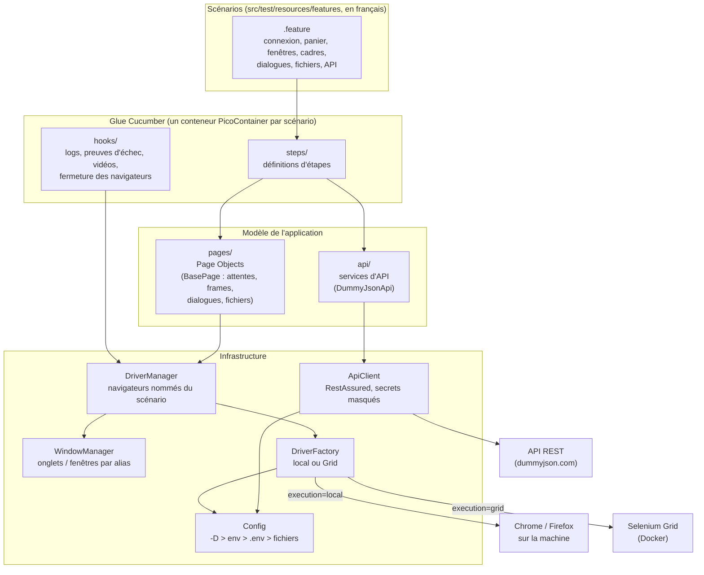
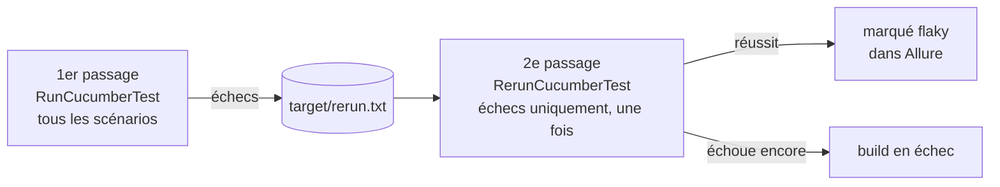
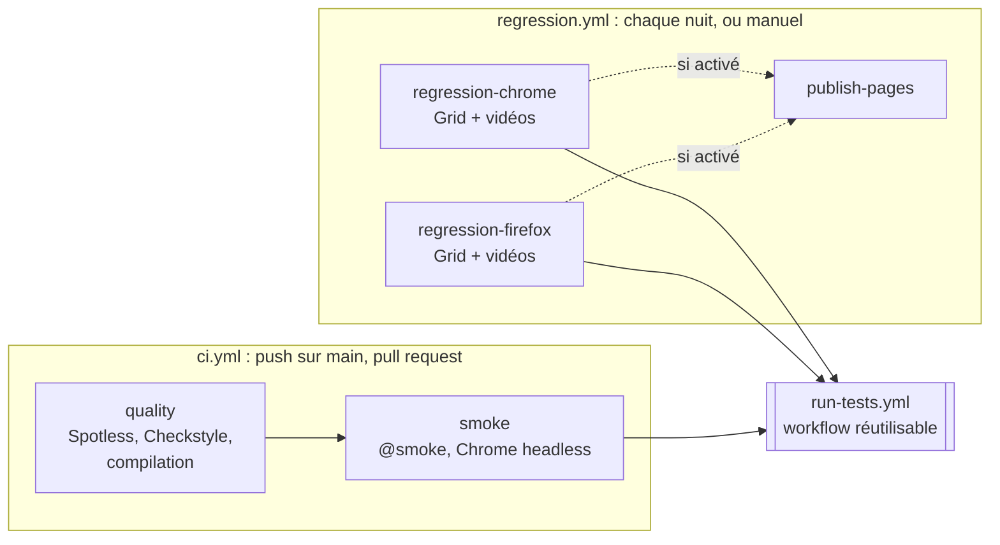

# Selenium BDD Framework

[](https://github.com/phlearning/selenium-bdd-framework/actions/workflows/ci.yml)
[](https://github.com/phlearning/selenium-bdd-framework/actions/workflows/regression.yml)

Framework d'automatisation de tests **UI et API** en **Java 21**, écrit en **BDD** (Gherkin en français) :
Selenium 4, RestAssured, Cucumber 7, JUnit 5, Allure, Selenium Grid dans Docker et GitHub Actions.

Ce qu'il montre :

- **Scénarios lisibles par le métier**, en français, sur deux applications web et une API REST.
- **Robustesse** : attentes explicites uniquement, réessai des actions quand le DOM bouge, **rejeu des scénarios
  en échec** avec détection des tests instables (*flaky*).
- **Parallélisation** par scénario, isolation complète (un conteneur d'injection et des navigateurs par scénario).
- **Multi** : onglets et fenêtres par alias, cadres imbriqués, **plusieurs navigateurs dans un même scénario**,
  boîtes de dialogue, envoi et téléchargement de fichiers, en local comme sur la Grid.
- **API** : RestAssured, validation de **schémas JSON**, secrets masqués dans les rapports.
- **Rapports** Allure avec historique, captures, source HTML, logs du scénario et **vidéo** des échecs.
- **CI** : contrôle qualité et `@smoke` à chaque PR, régression nocturne Chrome + Firefox sur Selenium Grid.

## Sommaire

- [Démarrage rapide](#démarrage-rapide)
- [Architecture](#architecture)
- [Écrire un scénario](#écrire-un-scénario)
- [Configuration](#configuration)
- [Robustesse](#robustesse)
- [Onglets, fenêtres, cadres et navigateurs multiples](#onglets-fenêtres-cadres-et-navigateurs-multiples)
- [Tests d'API](#tests-dapi)
- [Selenium Grid et vidéos](#selenium-grid-et-vidéos)
- [Intégration continue](#intégration-continue)
- [Rapports](#rapports)
- [Qualité du code](#qualité-du-code)
- [Choix techniques](#choix-techniques)
- [Feuille de route](#feuille-de-route)

## Démarrage rapide

Prérequis : **JDK 21** et **Docker**. Maven, les drivers et même le navigateur Chrome sont téléchargés
automatiquement (Maven Wrapper + Selenium Manager).

```bash
cp .env.example .env          # puis renseigner les identifiants de démo
docker compose up -d --wait   # démarre l'application the-internet en local (port 7080)
./mvnw test                   # tous les scénarios (hors @wip), Chrome visible
./mvnw allure:serve           # ouvre le rapport Allure
```

Exemples :

```bash
./mvnw test -Dcucumber.filter.tags="@smoke"          # filtrer par tags
./mvnw test -Dcucumber.filter.tags="@api"            # API uniquement : aucun navigateur ne démarre
./mvnw test -Dbrowser=firefox -Dheadless=true        # autre navigateur, sans interface
./mvnw test -Dthreads=8                              # nombre de scénarios en parallèle (défaut 4)
./mvnw test -DnoRerun                                # un seul passage, pas de rejeu
./mvnw test -Dsaucedemo.url=https://...              # surcharger n'importe quelle clé de configuration
```

Sur la Selenium Grid (Docker) :

```bash
docker compose --profile grid up -d --wait           # hub + 4 nœuds Chrome + 4 nœuds Firefox
./mvnw test -Dexecution=grid -Dvideo=true -Dthe-internet.url=http://the-internet:5000
```

## Architecture



```
src/test/java/io/github/phlearning/bdd/
├── api/       ApiClient (RestAssured, une réponse par scénario) · ApiReportingFilter (logs, Allure, masquage)
│              · DummyJsonApi (appels de l'API, équivalent d'un Page Object)
├── config/    Config - résolution des clés (sys props > env > .env > fichiers)
├── driver/    DriverFactory (local ou Grid) · DriverManager (navigateurs nommés du scénario)
│              · WindowManager (onglets et fenêtres par alias) · Downloads (local ou Grid)
├── pages/     Page Objects - BasePage : attentes explicites, frames, boîtes de dialogue, fichiers
│   ├── saucedemo/   connexion (formulaire ou cookie), catalogue, panier
│   └── internet/    fenêtres, cadres, alertes, téléversement, téléchargement
├── steps/     définitions d'étapes Gherkin (FR)
├── hooks/     ScenarioHooks (logs, preuves d'échec) · DriverHooks (fermeture, vidéos) · ReportHooks (infos Allure)
├── logging/   ScenarioLogAppender - capture les logs du scénario courant (par thread)
├── reporting/ FlakyResultsMarker (scénarios réussis au rejeu) · GridVideos (vidéo d'une session Grid)
└── runner/    RunCucumberTest (1er passage) · RerunCucumberTest (rejeu des échecs)
src/test/resources/
├── features/  scénarios .feature (# language: fr), un dossier par fonctionnalité
├── schemas/   schémas JSON des réponses d'API
├── testdata/  fichiers de test (téléversement…)
├── config/    propriétés par défaut et par environnement
├── allure/    catégories d'échec Allure
└── junit-platform.properties  glue, parallélisation, ressources exclusives
```

Principes :

- **Page Object Model + PicoContainer** : Cucumber crée un conteneur par scénario ; `DriverManager` et `ApiClient`
  y sont injectés dans les steps et les hooks. Chaque scénario est isolé, ce qui rend la parallélisation sûre.
- **Aucune attente implicite** : toute synchronisation passe par des attentes explicites dans `BasePage`
  (règle vérifiée par Checkstyle).
- **Navigateur démarré à la demande** : un scénario d'API n'ouvre jamais de navigateur.
- **Les steps ne contiennent ni sélecteur ni attente** : ils délèguent aux Page Objects et aux services d'API.

## Écrire un scénario

1. **Le scénario** dans `src/test/resources/features/<fonctionnalité>/`, en français (`# language: fr`), avec les
   tags adaptés :

   ```gherkin
   # language: fr
   @panier
   Fonctionnalité: Panier

     @smoke
     Scénario: Ajouter un produit au panier
       Soit l'utilisateur standard est connecté sans passer par le formulaire dans le navigateur "client"
       Quand dans le navigateur "client", j'ajoute le produit "Sauce Labs Backpack" au panier
       Alors dans le navigateur "client", le panier contient 1 article
   ```

2. **Les étapes** manquantes dans `steps/` : Cucumber propose leur squelette au premier lancement. Une étape
   récupère ce dont elle a besoin par son constructeur (`DriverManager`, `ApiClient`, un service d'API…) et
   délègue à un Page Object ; elle ne contient ni sélecteur ni attente.
3. **Le Page Object** dans `pages/<application>/`, qui étend `BasePage` : sélecteurs en constantes `By`,
   interactions via `click`, `type`, `textOf`, `inFrame`… qui attendent et réessaient d'elles-mêmes.

| Tag | Effet |
|---|---|
| `@smoke` | parcours essentiels, lancés à chaque push et PR |
| `@regression` | cas complémentaires (la régression nocturne lance tout sauf `@wip`) |
| `@api` | scénarios d'API, sans navigateur |
| `@sequential` | scénario exécuté seul, sans parallélisme (isole toute sa *feature*) |
| `@wip` | en cours d'écriture, exclu par défaut |
| `@auth`, `@panier`, `@fenetres`… | un tag par fonctionnalité, pour filtrer |

## Configuration

Chaque clé (ex. `saucedemo.url`) est résolue dans cet ordre, la première source qui la définit gagne :

1. propriété système `-Dsaucedemo.url=…`
2. variable d'environnement `SAUCEDEMO_URL`
3. fichier local `.env` (ignoré par git - modèle : [`.env.example`](.env.example))
4. `src/test/resources/config/environments/<env>.properties`
5. `src/test/resources/config/default.properties`

Aucun secret n'est versionné : les identifiants viennent de `.env` en local et des *secrets* GitHub en CI.

| Clé | Défaut | Rôle |
|---|---|---|
| `env` | `demo` | environnement cible |
| `saucedemo.url` | `https://www.saucedemo.com` | boutique de démo |
| `the-internet.url` | `http://localhost:7080` | the-internet (Docker local) |
| `dummyjson.url` | `https://dummyjson.com` | API REST de démo |
| `browser` | `chrome` | `chrome` \| `firefox` |
| `headless` | `false` | navigateur sans interface |
| `window.width` / `window.height` | `1920` / `1080` | taille de fenêtre |
| `timeout.explicit` | `10` | attente explicite (s) |
| `timeout.page.load` | `30` | chargement de page (s) |
| `execution` | `local` | `local` (navigateur sur la machine) \| `grid` (Selenium Grid) |
| `grid.url` | `http://localhost:4444` | adresse du hub |
| `video` | `false` | enregistre les sessions Grid ; vidéo jointe aux scénarios en échec |
| `video.dir` / `timeout.video` | `.grid/videos` / `30` | dossier des vidéos (monté dans les nœuds), attente de finalisation (s) |
| `downloads.dir` | `target/downloads` | téléchargements des navigateurs locaux (un sous-dossier par navigateur) |
| `sauce.username` / `sauce.password` | - | identifiants de la boutique de démo |
| `dummyjson.username` / `dummyjson.password` | - | identifiants de l'API de démo |

## Robustesse

### Exécution parallèle

Les scénarios s'exécutent en parallèle (un scénario = un thread = ses navigateurs), `-Dthreads=N` pour régler le
nombre de threads. Chaque scénario ayant son propre conteneur PicoContainer, rien n'est partagé entre threads.

Un scénario tagué **`@sequential`** s'exécute seul, sans aucun autre scénario en parallèle. JUnit applique ce
verrou à toute la *feature* qui le contient : regrouper ces scénarios dans un fichier `.feature` dédié.

### Rejeu des scénarios en échec



Deux niveaux :

1. **Action** : `BasePage` réessaie chaque interaction (élément recréé, masqué par un overlay, pas encore
   interactif) jusqu'au délai `timeout.explicit`.
2. **Scénario** : deux exécutions Surefire. Le 1er passage écrit les échecs dans `target/rerun.txt` sans faire
   échouer le build ; le 2e les rejoue **une fois** et décide du résultat.

Un scénario qui échoue puis réussit apparaît dans Allure avec son historique de tentatives, marqué **flaky** et
classé dans la catégorie « Tests instables ». `-DnoRerun` désactive le rejeu (pratique en local).

### Preuves et logs

| Quand | Quoi | Où |
|---|---|---|
| toujours | logs du scénario (actions, étapes, appels d'API) | pièce jointe « Logs » dans Allure / Cucumber HTML |
| toujours | requêtes et réponses d'API, secrets masqués | pièces jointes de l'étape |
| en échec | capture d'écran, URL, source HTML (de chaque navigateur) | pièces jointes du scénario |
| en échec, Grid + `video=true` | vidéo de chaque navigateur | pièce jointe « Video » |
| toujours | logs de tout le passage (tous threads, nom du scénario dans chaque ligne) | `target/logs/test-run.log`, `test-rerun.log` |

Les mots de passe sont saisis via `typeSecret` et n'apparaissent jamais dans les logs.
Niveaux réglables : `-DLOG_LEVEL=INFO` (fichiers et pièces jointes), `-DCONSOLE_LOG_LEVEL=DEBUG` (console).

## Onglets, fenêtres, cadres et navigateurs multiples

### Onglets et fenêtres

`WindowManager` (un par navigateur) désigne les fenêtres par **alias** plutôt que par identifiant technique.
La fenêtre de départ s'appelle `principale`.

| Besoin | API | Étape Gherkin |
|---|---|---|
| fenêtre ouverte par l'application (lien `target=_blank`, popup) | `openedBy(alias, action)` : attend la nouvelle fenêtre et bascule dessus | `je clique sur le lien qui ouvre la fenêtre "nouvelle"` |
| nouvel onglet / nouvelle fenêtre | `openTab(alias, url)` · `openWindow(alias, url)` | `j'ouvre un nouvel onglet "alertes" sur la page "/javascript_alerts"` |
| basculer | `switchTo(alias)` · `switchToTitle(titre)` | `je bascule sur la fenêtre "alertes"` |
| fermer et revenir à `principale` | `close(alias)` | `je ferme la fenêtre "nouvelle"` |

### Cadres (frames / iframes)

`BasePage.inFrame(action, cadre1, cadre2…)` entre dans des cadres imbriqués (du plus externe au plus interne),
exécute l'action puis **revient toujours** au document principal, même en cas d'échec.

### Boîtes de dialogue et fichiers

`BasePage.dialog()` attend une boîte `alert` / `confirm` / `prompt` ; `BasePage.upload(input, fichier)` renseigne
un `<input type="file">` avec un fichier de `src/test/resources/testdata/`. `Downloads.waitFor(nom)` attend la fin
d'un téléchargement et renvoie le fichier local.

Les deux fonctionnent aussi sur la Grid : le fichier à envoyer est transmis au nœud (`LocalFileDetector`), le fichier
téléchargé est rapatrié depuis le nœud (*managed downloads* de la Grid).

### Plusieurs navigateurs dans un scénario

`DriverManager` gère des **sessions nommées** : `use("Alice")` démarre (si besoin) puis active le navigateur
« Alice ». Les Page Objects travaillent toujours sur la session active. En cas d'échec, les preuves sont jointes
**pour chaque navigateur** (`Screenshot (Alice)`, `Screenshot (Bob)`…).

```gherkin
Soit l'utilisateur standard est connecté sans passer par le formulaire dans le navigateur "Alice"
Et l'utilisateur standard est connecté sans passer par le formulaire dans le navigateur "Bob"
Quand dans le navigateur "Alice", j'ajoute le produit "Sauce Labs Backpack" au panier
Alors dans le navigateur "Bob", le panier est vide
```

**Connexion sans formulaire** : quand la connexion n'est pas le sujet du scénario, `LoginPage.loginBypassingForm`
pose directement le cookie de session de saucedemo au lieu de remplir le formulaire (l'équivalent d'une connexion
par API, que saucedemo n'a pas). Le formulaire garde ses propres scénarios (`auth/connexion.feature`).

## Tests d'API

Scénarios `@api` sur l'API de démo [DummyJSON](https://dummyjson.com) : authentification par jeton (cas nominal,
mot de passe incorrect, profil sans jeton ou avec un jeton invalide) et catalogue (consultation, 404, recherche,
création).

```gherkin
Scénario: Un utilisateur valide obtient un jeton et consulte son profil
  Quand je m'authentifie sur l'API avec l'utilisateur de démonstration
  Alors la réponse a le statut 200
  Et la réponse respecte le schéma "jeton"
  Et la réponse contient un jeton d'accès
  Quand je consulte mon profil avec ce jeton
  Alors la réponse a le statut 200
  Et la réponse respecte le schéma "profil"
```

- `DummyJsonApi` regroupe les appels (l'équivalent d'un Page Object) ; `ApiClient` construit les requêtes et garde
  la dernière réponse du scénario pour les étapes `Alors`.
- **Contrat** : `la réponse respecte le schéma "produit"` valide la réponse contre `schemas/produit.json`
  (JSON Schema), pas seulement quelques champs.
- **Rapports** : chaque requête et réponse est jointe à l'étape Allure. `ApiReportingFilter` **masque les secrets**
  (en-têtes `Authorization`, champs `password`, `accessToken`…) y compris dans les réponses : le profil renvoyé par
  DummyJSON contient le mot de passe en clair.

## Selenium Grid et vidéos

`docker compose --profile grid up -d --wait` démarre un hub et des nœuds Chrome / Firefox
(`CHROME_NODES` / `FIREFOX_NODES`, 4 par défaut). Chaque nœud n'accepte **qu'une session** : un navigateur par
écran, donc une vidéo lisible par session. Prévoir au moins `threads + 1` nœuds (un scénario peut piloter deux
navigateurs).

- Les navigateurs de la Grid joignent the-internet par le réseau Docker : `-Dthe-internet.url=http://the-internet:5000`
  (ou `THE_INTERNET_URL` dans `.env`).
- Avec `-Dvideo=true`, chaque session est enregistrée (`se:recordVideo`) dans `.grid/videos/<sessionId>.mp4`.
  La vidéo de chaque navigateur d'un scénario en échec est jointe au rapport Allure. Pas de vidéo en headless.
- Console de la Grid : <http://localhost:4444> (sessions en cours, VNC).

## Intégration continue



| Workflow | Déclencheur | Contenu |
|---|---|---|
| [`ci.yml`](.github/workflows/ci.yml) | push sur `main`, pull request | qualité du code, puis `@smoke` (UI et API) sur Chrome headless |
| [`regression.yml`](.github/workflows/regression.yml) | chaque nuit (02:00 UTC) | tout sauf `@wip`, Chrome **et** Firefox en parallèle (matrice), Grid Docker, vidéos |
| [`regression.yml`](.github/workflows/regression.yml) | manuel (*Run workflow*) | navigateur, tags, local / Grid, vidéos, threads, environnement au choix |

Le workflow réutilisable [`run-tests.yml`](.github/workflows/run-tests.yml) :

- démarre the-internet (et la Grid si besoin) avec `docker compose`, lance `./mvnw test` avec le rejeu des échecs ;
- publie les résultats JUnit dans les *checks* et le résumé du job (1er passage et rejeu séparés) ;
- génère le rapport Allure en conservant l'**historique** d'un run à l'autre (cache GitHub Actions) : tendances,
  tests instables, rejeux ;
- dépose en *artifacts* le rapport Allure, les logs et les rapports Cucumber (14 jours).

Secrets du dépôt : `SAUCE_USERNAME`, `SAUCE_PASSWORD`, `DUMMYJSON_USERNAME`, `DUMMYJSON_PASSWORD`.

**GitHub Pages** : le job `publish-pages` de `regression.yml` publie les rapports Allure de `main`. Il est désactivé
tant que le dépôt ne peut pas servir de Pages (dépôt privé sur l'offre gratuite) ; pour l'activer : variable de dépôt
`PUBLISH_ALLURE_PAGES=true` et source Pages « GitHub Actions ».

**Dependabot** ([`dependabot.yml`](.github/dependabot.yml)) propose chaque lundi les mises à jour Maven, GitHub
Actions et images de la Grid, regroupées. Les versions majeures des briques structurantes (Cucumber, JUnit, Allure,
RestAssured) sont exclues : elles se migrent ensemble, volontairement.

## Rapports

| Rapport | Emplacement |
|---|---|
| Allure | `./mvnw allure:report` → `target/site/allure-maven-plugin/index.html` (ou `allure:serve`) |
| Cucumber HTML | `target/cucumber-reports/cucumber.html` (+ `cucumber-rerun.html` pour le rejeu) |
| JUnit XML | `target/surefire-reports/`, `target/surefire-reports-rerun/` (lus par la CI) |

Le rapport Allure inclut l'onglet **Environment** (environnement, URL, navigateur, exécution, OS…) et des
**catégories** d'échec (assertion, synchronisation, infrastructure, configuration, instables) définies dans
`src/test/resources/allure/categories.json`.

## Qualité du code

```bash
./mvnw spotless:apply        # formate le code (palantir-java-format, ordre des imports)
./mvnw checkstyle:check      # règles du projet (config/checkstyle.xml)
```

Les deux sont vérifiés par la CI avant tout test. Au-delà des règles classiques (imports, nommage, blocs vides),
[`config/checkstyle.xml`](config/checkstyle.xml) contient des règles propres à l'automatisation de tests :

- pas de `Thread.sleep` ni d'attente implicite : uniquement des attentes explicites ;
- pas de `System.out` ni de `printStackTrace` : les logs SLF4J sont joints au rapport du scénario ;
- pas de tiret cadratin (convention de rédaction du projet).

## Choix techniques

| Choix | Pourquoi |
|---|---|
| **Cucumber 7, JUnit 5, Allure 2, RestAssured 5** plutôt que les majeures sorties en 2026 | combinaison stable et éprouvée ; la migration se fera d'un bloc, pas au fil de Dependabot |
| **PicoContainer** | injection légère par scénario : isolation et parallélisation sans `ThreadLocal` global |
| **Rejeu en deux passages Surefire** plutôt que `rerunFailingTestsCount` | explicite, fiable avec le moteur Cucumber de JUnit 5, les deux passages restent visibles |
| **Nœuds Grid à une session** | une vidéo lisible par session ; la capacité se règle par le nombre de nœuds |
| **the-internet en Docker** plutôt que l'instance publique | l'instance publique répond trop lentement ou pas du tout : des tests dessus seraient instables par nature |
| **Filtre de rapport d'API maison** plutôt que `allure-rest-assured` | masquer les secrets dans les corps de requêtes **et de réponses** |
| **Gherkin en français, code en anglais** | scénarios lisibles par le métier, code aux conventions habituelles |

## Feuille de route

- [x] **1. Socle** - Maven, configuration, gestion des navigateurs, POM, PicoContainer, scénarios `@smoke`, Allure
- [x] **2. Robustesse** - parallélisation, rejeu des scénarios en échec, captures d'écran, logs
- [x] **3. Multi** - onglets, fenêtres, iframes, plusieurs navigateurs par scénario
- [x] **4. CI** - Selenium Grid (Docker), vidéos, GitHub Actions (push / nightly / manuel), rapports
- [x] **5. API & qualité** - RestAssured, schémas JSON, Spotless, Checkstyle, Dependabot, documentation
- [ ] **6. Jenkins** - `Jenkinsfile` équivalent

## Applications testées

| Application | Rôle | Accès |
|---|---|---|
| [saucedemo.com](https://www.saucedemo.com) | parcours métier : connexion, catalogue, panier | en ligne ; identifiants de démo affichés sur sa page de connexion |
| the-internet | cas techniques : fenêtres, cadres, alertes, fichiers | en local via `docker compose up -d` (image `gprestes/the-internet`) |
| [DummyJSON](https://dummyjson.com) | API REST : authentification par jeton, produits | en ligne ; utilisateurs de démo listés sur <https://dummyjson.com/users> |
