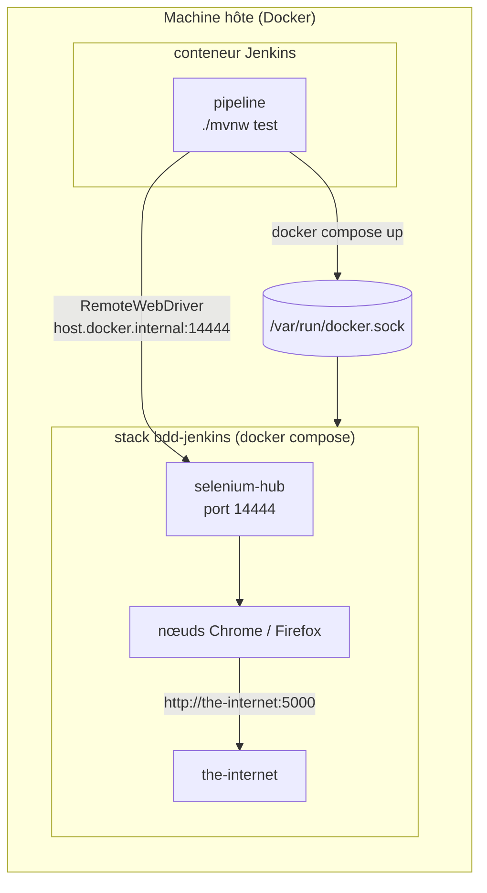

# Jenkins local

Un Jenkins prêt à l'emploi pour exécuter et tester le [`Jenkinsfile`](../Jenkinsfile) du projet, sans rien
configurer à la main : plugins, identifiants, outil Allure et job sont créés au démarrage
(*Configuration as Code*, [`casc.yaml`](casc.yaml)).

## Démarrer

Prérequis : Docker, et le fichier `.env` du projet rempli (identifiants de démo et `JENKINS_ADMIN_PASSWORD`,
voir [`.env.example`](../.env.example)).

```bash
jenkins/start.sh                                   # job sur la branche main
JENKINS_BRANCH=ma-branche jenkins/start.sh         # job sur une autre branche (commitée)
```

Jenkins : <http://localhost:8080>, utilisateur `admin`, mot de passe `JENKINS_ADMIN_PASSWORD` du `.env`.

Arrêter : `docker compose -f jenkins/docker-compose.yml down` (les données restent dans `jenkins/.data/`,
à supprimer pour repartir de zéro).

## Le job `selenium-bdd-framework`

| Déclencheur | Build |
|---|---|
| nouveau commit sur la branche (scrutation toutes les 5 min) | qualité + `@smoke` sur Chrome |
| chaque nuit | régression complète : Chrome à 02:xx, Firefox à 03:xx, avec vidéos |
| *Build with Parameters* | `SUITE` (smoke / regression), `TAGS`, `BROWSER`, `VIDEO`, `THREADS`, `TEST_ENV` |

Étapes : **Préparation** → **Qualité** (Spotless, Checkstyle, compilation) → **Environnement de test**
(`docker compose` : the-internet + Selenium Grid) → **Tests** (sur la Grid, avec rejeu des échecs).

Après chaque build : résultats JUnit (1er passage et rejeu, sans rendre le build instable : c'est Maven qui
décide), **rapport Allure** avec historique et tendances d'un build à l'autre, logs et rapports Cucumber en
artefacts, puis arrêt de la stack Docker.

Au tout premier build, et après chaque redémarrage (le job est recréé par la configuration *as code*), Jenkins ne
connaît pas encore les paramètres déclarés dans le `Jenkinsfile` : le build tourne avec les valeurs par défaut
(`smoke`, Chrome) et le bouton *Build with Parameters* apparaît ensuite.

## Comment ça marche



- Le conteneur Jenkins pilote le Docker de la machine (socket monté) : la stack de test est lancée à côté de lui,
  sous le nom de projet `bdd-jenkins` et sur d'autres ports (14444, 17080) que la stack de développement
  (4444, 7080). Les deux peuvent tourner en même temps.
- Les navigateurs tournent toujours sur la Grid : l'agent Jenkins n'a besoin que de Java 21 et de Docker.
- `JENKINS_HOME` est monté **au même chemin** que sur l'hôte : `docker compose`, exécuté par le démon de l'hôte,
  résout les montages (dossier des vidéos) avec des chemins de l'hôte, qui doivent donc exister à l'identique.
- Le job clone le dépôt monté en lecture seule dans `/repo` (`file:///repo`) : pas besoin d'identifiants GitHub.

## Valider le Jenkinsfile sans lancer de build

Le linter des pipelines déclaratifs de Jenkins vérifie la syntaxe :

```bash
curl -u "admin:$JENKINS_ADMIN_PASSWORD" -X POST -F "jenkinsfile=<Jenkinsfile" \
  http://localhost:8080/pipeline-model-converter/validate
```

(Avec un Jenkins dont la protection CSRF est active, obtenir d'abord un *crumb* via `/crumbIssuer/api/json`.)

## Utiliser ce Jenkinsfile sur un vrai Jenkins

- plugins : ceux de [`plugins.txt`](plugins.txt) ;
- identifiants *Secret text* : `sauce-username`, `sauce-password`, `dummyjson-username`, `dummyjson-password` ;
- outil Allure nommé `allure` (Administrer Jenkins > Tools) ;
- agent avec Java 21, Docker et le plugin compose ; si Jenkins lui-même tourne dans un conteneur, appliquer le même
  principe de chemin identique pour `JENKINS_HOME` ;
- job *Pipeline script from SCM* (ou *Multibranch*) pointant sur le dépôt, script `Jenkinsfile`.
